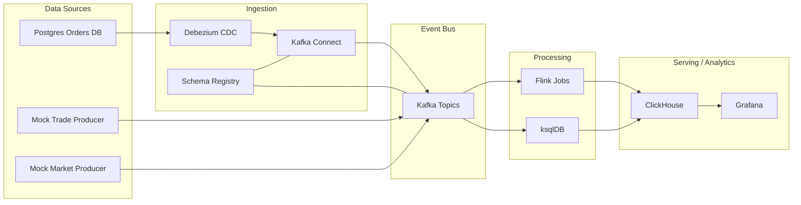

# init-project.md

## 프로젝트명
Realtime Trading Data Platform

## 문서 목적
이 문서는 프로젝트의 **초기 구조와 방향성만 정의하는 스펙 문서**다.  
세부 구현보다 먼저, **로컬 환경에서 전체 컴포넌트를 모두 기동하고**,  
재기동 후에도 주요 데이터가 유지되는 개발/검증 환경을 만드는 것을 1차 목표로 한다.

---

## 1. 프로젝트 목표

### 1차 목표
- Docker Compose 기반으로 전체 컴포넌트를 로컬에서 실행 가능해야 한다.
- 각 컴포넌트가 네트워크로 연결되어 end-to-end 흐름이 동작해야 한다.
- 컨테이너를 내렸다가 다시 띄워도 주요 데이터가 유지되어야 한다.
- 최소한의 샘플 데이터로 아래 흐름을 검증할 수 있어야 한다.
  - 주문 생성
  - 주문 정정
  - 주문 취소
  - 체결 이벤트 유입
  - 실시간 집계
  - OLAP 적재
  - 대시보드 조회

### 2차 목표
- Flink 상태 처리, checkpoint/savepoint, dedup, late event 처리까지 확장한다.
- CDC와 mock producer를 함께 사용해 실제 운영 구조에 가까운 형태로 발전시킨다.

---

## 2. 범위(Scope)

### 포함
- Postgres
- Debezium
- Kafka
- Kafka Connect
- Schema Registry
- Flink JobManager / TaskManager
- ksqlDB
- ClickHouse
- Grafana
- Mock event producer
- Init / bootstrap 스크립트
- Persistent volume

### 제외(초기 단계)
- 멀티노드 Kafka HA
- Kubernetes 배포
- 운영급 보안 설정(SASL, TLS, RBAC)
- 대규모 부하 테스트
- 멀티 AZ / DR
- 실거래 연동

---

## 3. 핵심 요구사항

### 3.1 전체 컴포넌트 로컬 기동
아래 컴포넌트가 `docker compose up -d` 기준으로 모두 올라와야 한다.

- postgres
- zookeeper (초기 단순화 목적, 추후 KRaft 전환 가능)
- kafka
- schema-registry
- kafka-connect
- debezium-ui (선택)
- flink-jobmanager
- flink-taskmanager
- ksqldb-server
- clickhouse
- grafana
- simulator
- init-topics / bootstrap

### 3.2 재기동 후 데이터 유지
아래 데이터는 컨테이너 재생성 이후에도 남아 있어야 한다.

- Postgres 데이터
- Kafka 로그 데이터
- ClickHouse 데이터
- Grafana dashboard / datasource 설정
- Flink checkpoint / savepoint 디렉토리

### 3.3 End-to-End 검증 가능
다음 흐름을 확인할 수 있어야 한다.

1. Postgres 주문 데이터 insert/update
2. Debezium CDC 이벤트 생성
3. Kafka 토픽 적재
4. Flink 또는 ksqlDB 처리
5. ClickHouse 저장
6. Grafana 조회

---

## 4. 버전 정책

### Host 환경
- 로컬 JDK는 21 사용
- 로컬 JDK는 변경하지 않는다

### 프로젝트 기준
- Java source/target: 17
- Kotlin JVM target: 17
- Kotlin: stable 최신 버전 사용
- Flink runtime: Java 17 기반으로 시작
- 추후 Flink runtime Java 21 호환성 검증은 별도 단계로 진행

### 왜 이렇게 잡는가
- 호스트 JDK 21을 유지해도 Docker 기반 실행에는 문제가 없다.
- 컨테이너는 자체 런타임을 사용하므로 Compose로 띄운 Flink/Kafka/ClickHouse는 호스트 JDK와 직접 결합되지 않는다.
- 다만 빌드 산출물(JAR)이 컨테이너 런타임보다 높은 bytecode target을 가지면 실행 문제가 생길 수 있으므로 초기에는 Java/Kotlin 컴파일 타깃을 17로 고정한다.
- 초기 안정화 단계에서는 Java 17 기준이 가장 안전하다.

### 주의
- Java 21로 컴파일한 바이트코드를 Java 17 런타임에서 실행하는 방식은 피한다.
- Gradle toolchain 또는 `--release 17`을 사용해 빌드 타깃을 고정한다.

---

## 5. 아키텍처 개요


## 6. 컴포넌트별 역할

### Postgres
- 주문, 계좌, 참조 데이터 저장
- CDC source 역할

### Debezium + Kafka Connect
- Postgres 변경사항을 Kafka 이벤트로 발행
- insert/update/delete를 event stream으로 변환

### Kafka
- 전체 실시간 이벤트 버스
- raw topic / normalized topic / aggregation topic / dlq topic 구성

### Schema Registry
- 이벤트 스키마 관리
- schema evolution 대응 기반

### Flink
- 정규화
- dedup
- 상태 기반 주문 재구성
- 집계
- anomaly detection

### ksqlDB
- 운영성 높은 실시간 조회
- 간단한 stream/table 변환
- 빠른 실험용 SQL layer

### ClickHouse
- raw event 저장
- 집계 테이블 저장
- 실시간 분석 쿼리 수행

### Grafana
- 운영/비즈니스 대시보드 조회

### Simulator
- 주문/체결/시세 mock 이벤트 생성
- CDC 외 이벤트 입력 역할

---

## 7. 볼륨 전략

### 반드시 영속화할 경로

#### Postgres
- `/var/lib/postgresql/data`

#### Kafka
- 브로커 로그 디렉토리
- 예: `/var/lib/kafka/data` 또는 이미지별 kafka data path

#### ClickHouse
- `/var/lib/clickhouse`

#### Grafana
- `/var/lib/grafana`

#### Flink
- checkpoint 디렉토리
- savepoint 디렉토리
- 예:
  - `/opt/flink/checkpoints`
  - `/opt/flink/savepoints`

### 볼륨 원칙
- named volume 우선 사용
- bind mount는 설정 파일 편집이 필요한 영역에 한정
- 상태 데이터는 named volume으로 유지
- 로그/임시 파일은 필요 시 ephemeral로 유지 가능

---

## 8. 초기 토픽 설계

### Raw Topics
- `order-events.raw`
- `trade-events.raw`
- `market-ticks.raw`
- `reference-data.raw`

### Processed Topics
- `order-events.normalized`
- `order-state.current`
- `trade-agg.1m`
- `risk-alerts`

### 운영성 Topics
- `dlq.order-events`
- `dlq.trade-events`
- `pipeline-metrics`

---

## 9. 초기 검증 시나리오

### 시나리오 A: CDC 확인
1. Postgres에 주문 row insert
2. Debezium이 CDC 이벤트 생성
3. Kafka `order-events.raw`에 반영되는지 확인

### 시나리오 B: 주문 상태 재구성
1. 주문 생성
2. 주문 정정
3. 일부 체결
4. 취소
5. 최종 상태가 `order-state.current` 또는 ClickHouse에 반영되는지 확인

### 시나리오 C: 실시간 집계
1. trade 이벤트 다건 투입
2. Flink/ksqlDB가 1분 집계 생성
3. ClickHouse aggregate 테이블에 적재
4. Grafana에서 조회

### 시나리오 D: 재기동 내구성
1. 데이터를 넣는다
2. `docker compose down`
3. 다시 `docker compose up -d`
4. Postgres / Kafka / ClickHouse / Grafana / Flink 상태가 유지되는지 확인

---

## 10. 구현 전략

### Phase 1: 로컬 인프라 부팅
- `compose.yml` 작성
- 네트워크 / 볼륨 구성
- 개별 서비스 기동 확인

### Phase 2: 데이터 입력 경로 구성
- Postgres + Debezium + Kafka Connect 연결
- mock producer 추가

### Phase 3: 처리 파이프라인 연결
- Flink 샘플 job 배포
- ksqlDB stream/table 정의
- ClickHouse sink 연결

### Phase 4: 조회 / 운영성
- Grafana 연결
- 샘플 dashboard 생성
- smoke test 스크립트 작성

### Phase 5: 안정성 / 정합성 강화
- dedup
- watermark
- checkpoint/savepoint
- DLQ
- 모니터링 메트릭

---

## 11. 디렉토리 구조(초안)

```text
realtime-trading-platform/
├── README.md
├── init-project.md
├── docs/
│   ├── architecture.md
│   ├── topic-design.md
│   ├── local-run.md
│   └── decisions.md
├── infra/
│   ├── compose.yml
│   ├── compose.override.yml
│   ├── env/
│   ├── postgres/
│   ├── kafka/
│   ├── connect/
│   ├── flink/
│   ├── clickhouse/
│   └── grafana/
├── simulator/
│   ├── order-producer/
│   ├── trade-producer/
│   └── market-producer/
├── flink-jobs/
│   ├── common/
│   ├── normalize-dedup-job/
│   ├── order-state-builder-job/
│   └── trade-aggregation-job/
├── ksqldb/
│   ├── streams.sql
│   └── tables.sql
└── scripts/
    ├── bootstrap.sh
    ├── seed-data.sh
    └── smoke-test.sh
```
